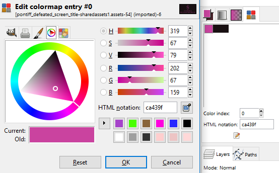

# Blasphemous Modding Notes
  
### Introduction
These notes are subjective, they quite possibly *don't* cover all possible tools and options, and I take no responsibility for you accidentally fucking up your install and/or saves. I started writing them first and foremost for my own reference, given that the modding documentation for Blasphemous was practically nonexistent. Needless to say, they're still extremely incomplete.  
  
A large part of this file is written in the form of a tutorial, mainly because that makes it much easier for me to write.  
  
Notably, no prior image editing/coding experience is necessary to follow these notes (although it's certainly useful).  
  
### Basic terms  
Modding and code/asset editing use specific terminology; here I provide a short overview of some basic terms I'll be using in these notes.  
  
**Alpha** - image transparency  
**Asset** - image, video, sound, or other file used for something in the game (for example, an NPC, level design, etc.); in broader sense, any file used by the game  
**Level** - in Blasphemous, a level is one "room"; so every area consist of at least one level (usually more)
**Vanilla** - unmodded, original game or assets  
  
### File and folder structure
For the purposes of these notes, I will be using the following folder structure and names:
```
Steam\steamapps\common\Blasphemous (= ROOT folder)
--\Blasphemous_Data (= DATA folder; vanilla folder which holds game data, obviously)
--\--\data.unity3d (vanilla file containing )
--\--\Managed (vanilla folder with .dll files)
--\--\--\Assembly-CSharp.dll (vanilla file containing game logic and generally extremely important stuff)
--\--\--\Mods (added when copying edited .dll files from Output)
--\Blasphemous_Data_BACKUP (unedited copy of vanilla game data, in case of a fuckup)
--\Goodies (vanilla folder with additional stuff like the official artbook or comic)
--\Modding_Code (modding API, and any mod source code)
--\Modding_Graphics_Export (unpacked data.unity3d, and unedited .png images exported from it)
--\Modding_Graphics_Import (edited .png images, and .psd or .xcf source files)
--\Modding_Tools (includes Save Editor and various other things)
```
The two `Modding_Graphics_` folders are irrelevant unless you want to mod the sprites (that is, graphic assets).  
  
To save hard drive space, I did not back up all of the game data; for any sort of modding I describe in these notes, it is actually enough to back up up to two files:  
- `data.unity3d` (in the ROOT folder) - back it up if you plan to do graphic modding  
- `Assembly-CSharp.dll` (in DATA, in the `Managed` folder) - back it up if you plan to do code editing  
  
---
  
## Graphic replacers  
**Requirements:** Gimp, UABE  
  
### Preparations  
--write how to extract stuff with UABE!!!  
### Example: Removing shadow from text screens
Perhaps the header itself is a bit misleading: I mean the screens that say `REQUIEM AETERNAM`, `DETESTATIO SACRORUM`, or `SUMMA BLASPHEMIA`.  
1. Find the .png files you want to edit in `Modding_Graphics_Export`. Note that depending on the sprite you're modding, it might not be easy to find the correct file. When in doubt, use a quick and simple test: open the .png you suspect might be the one you're looking for. Fill the whole background with some color (or make another big, noticeable change), and import the result into your game data. If you can notice the change in-game in the place you expect it, it means it's the correct asset.  
  
Example:  
  
  
Anyway, the assets needed here are:  
```
boss_defeated_screen_title-sharedassets1.assets-66.png
confessor_area_screen_title-sharedassets1.assets-38.png
pontiff_defeated_screen_title-sharedassets1.assets-54.png
```
2. Open them all in GIMP.  
3. Select the black parts (best tool for that is `Select by color`); note that there are a few different shades used, so if the selection treshold is 0, you'll need to click each of them (in `Mode`, you can use the second option, `Add`, which adds the newly selected area to existing selection instead of replacing it). Remember to **uncheck** `Antialiasing` and `Feather edges`. Delete using `del` or `Ctrl + X`.  
4. Side note: While editing `REQUIEM AETERNAM`, I also noticed that the different shades of orange look bad without the background, so I decided to use only one shade. However, it turns out only the `AE` is problematic (I checked by selecting by color the main part of the text, and the alpha background - 2 clicks with treshold 0, and then inverted the selection to see which parts had anything other than these two colors). I ended up simply editing that letter by hand, using 1-pixel brush.  
  
Before and after (selection to show edited parts):  
  
5. One more side note: Then I decided to slightly alter the color of `SUMMA BLASPHEMIA` text to add some more blue. This can be done for example by editing the color palette. Go to `Windows -> Dockable dialogs -> Colormap`. Double-click the color you want to edit. I changed it from `#ca439f` to `#8943ca`.  
  
Palette editing in GIMP:  
  
6. Save the .png files in `Modding_Graphics_Import` and put them in the game assets using UABE.  
  
--graphic replacer (sprite change - example: flying head -> skull)  
  
---
  
## Code editing  
### In-game console  
The debug console is included in the vanilla game, but it is normally not accessible to the users. It is extremely useful for testing mods and previewing how vanilla game behaves without having to play through the whole content normally. There is a mod that *should* enable the console: [Blasphemous Debug Console](https://www.nexusmods.com/blasphemous/mods/2) - however, it does not work for some users (including myself), and seems to be based on an earlier version of the game than the one currently available on Steam. Enabling the console on your own takes around a minute, probably much less than it would take to get the mod to work with the updated game version.  
  
I used [dnSpy](https://github.com/0xd4d/dnSpy/releases) to enable the console.  
1. Open dnSpy.  
2. Open `Assembly-CSharp.dll` with it (use the version from your `Managed` folder, not the backup version!)  
3. Find the window `Assembly Explorer` and go to `Assembly-CSharp (0.0.0.0) -> Assembly-CSharp.dll -> Gameplay.UI.Widgets`  
4. Double-click on `ConsoleWidget`.  
5. Hit `Ctrl + F` and enter `isDebugBuild` in the search bar to find the line that you want to edit.  
The full line should look like this:  
```
			if (Input.GetKeyDown(KeyCode.F1) && Debug.isDebugBuild)
```
6. Right-click on *the empty space* next to that line. Go to `Edit Method (C#)...`.  
Modify it to look like this:
```
			// if (Input.GetKeyDown(KeyCode.F1) && Debug.isDebugBuild)
			if (Input.GetKeyDown(KeyCode.F1))
```
The first line is the original one, but commented out with `//` - that is, it's inactive. With small tweaks like this, I prefer to leave the original line commented out, in case I wanted to use it later. However, it could also simply be deleted with no effect upon the game itself.
The second line had a part of its condition removed - so that, in simple words, the console would work on regular (non-testing) versions of the game.
In the same line, the console hotkey can be changed. For example, being an MW modder used to bringing up the console with a backtick ( \` ), I found it much more convenient to open Blasphemous console in the same way. Thus, my edit looks like this:
```
			// if (Input.GetKeyDown(KeyCode.F1) && Debug.isDebugBuild)
			if (Input.GetKeyDown(KeyCode.BackQuote))
```
Unity key code reference is available [here](https://docs.unity3d.com/ScriptReference/KeyCode.html).  
--add note that the comments aren't preserved, and best to save the decompiled source file!!!
7. Click `Compile`, go to `File -> Save Module`, and click `OK` in the saving options.  
8. Open the game. If you've done everything correctly, you should be able to access the console with the hotkey of your choice.  
  
### Console commands  
```
execution
execution y
execution n
```
Something to do with executions, needs testing.
```
flag
flag set IDFLAG
flag clear IDFLAG
flag test IDFLAG
```
Possibly related to quest states?
```
graybox
```
???
```
help
```
Displays a list of available commands.
```
invincible
```
Enables/disables invulnerability mode: the Penitent One's health isn't affected by enemy attacks or contact damage, and dying on the spikes respawns him in the last stable spot. Fervour still decreases normally, and flasks aren't refilled automatically. Note that this command might be buggy when the Penitent One falls into the depths (teleporting via the console might help in such a case).
```
invtest
```
Adds all items (rosary beads, prayers, Mea Culpa hearts, etc.) **Don't use this if you haven't gotten the relevant achievements yet, as it's not possible to remove Steam achievements!**  
--todo - check Steam Achievement Manager and other possible solutions?
```
kill all
```
Kills all entities in the current level. This includes the enemies **and** the player; also frees caged cherubs. NPCs - not tested yet.  
```
kill player
```
```
kill player prieudieu
```
```
kill NAME
```
```
language
language list
language current
language set LANGUAGE_CODE
```
These commands are related to language of the UI.
```
load
```
This command is helpful in quickly traversing a level. It seems to work if you use it in one level and then use the door to go to another one. Then a list of entrances to that level appears, along with an indication in which direction the door points to (N, S, W, E). Be careful, you might end up impaled on the spikes in some places.
```
map
```
```
map revealall
```
Should reveal all locations on the map. Note: might be buggy.
```
restart
```
Reloads current level. This might lead to an amusing bug in which you can end up with multiple Penitent Ones (it persists only on the current level).
```
sendevent
```
???
```
show_debug_ui
show_debug_ui off
show_debug_ui on
show_debug_ui current
```
Seems to do nothing visible.
```
showui
showui off
showui on
showui current
```
These commands toggle the UI - useful for screenshots. An interesting usage for this command is also trying to do a playthrough with UI turned off for added challenge.
--test the dialogs!
```
skin
skin list
skin get
skin unlock SKIN_ID
```
These commands are related to player skins/palettes.
```
testplan
```
???

  
#### Statistic/attribute commands
```
bonus
bonus help
bonus list
```
The last of these commands shows current bonuses (for example, to strenght or sword power).
```
fervour
fervour current
fervour set VALUE
fervour upgrade
fervour fill
fervour setmax VALUE
```
```
flask
flask current
flask set VALUE
flask upgrade
flask fill
flask setmax VALUE
```
```
health
health current
health set VALUE
health upgrade
health fill
health setmax VALUE
```
```
meaculpa
meaculpa current
meaculpa set VALUE
meaculpa upgrade
```
These commands are related to the power of the sword.
```
maxfervour
```
Fills the fervour bar; it won't go beyond the limit set by guilt.
```
purge
purge current
purge set VALUE
purge upgrade
purge fill
purge setmax VALUE
```
These commands are related to Tears of Atonement.
```
skill
skill list
skill lock SKILLNAME
skill unlock SKILLNAME
skill showui
```
These commands are related to extra attacks unlocked in the Mea Culpa shrines.
```
strength
strength current
strength set VALUE
strength upgrade
```
These commands are related to the strength of the Penitent One (no, really, imagine that).
  
#### Item commands
Note the typo in `equiped`.  
```
bead
bead list
bead listowned
bead setslots SLOTS
bead add IDBEAD
bead remove IDBEAD
bead equip IDBEAD SLOT
bead unequip SLOT
```
These commands are related to rosary beads.
```
collectible
collectible list
collectible listowned
collectible add IDCOLLECTIBLEITEM
collectible remove IDCOLLECTIBLEITEM
```
These commands are related to the collectible bones.
```
prayer
prayer list
prayer listowned
prayer add IDPRAYER
prayer remove IDPRAYER
prayer equiped
prayer equip IDPRAYER SLOT
prayer unequip SLOT
prayer decipher IDPRAYER NUMBER
```
These commands are related to prayers.
```
questitem
questitem list
questitem listowned
questitem add IDQUESTITEM
questitem remove IDQUESTITEM
```
These commands are related to various quest items.
```
relic
relic list
relic listowned
relic add IDRELIC
relic remove IDRELIC
relic equiped
relic equip IDRELIC SLOT
relic unequip SLOT
```
These commands are related to relics.

## other stuff: 
https://www.jetbrains.com/decompiler/  
 
https://docs.unity3d.com/ScriptReference/Input.GetKeyDown.html  
--https://keycode.info/  
--https://docs.unity3d.com/ScriptReference/KeyCode.html  
--cont. (remapping, check keycode syntax, find backtick key name, replace, save)  
  
--more other stuff  
-where is level data? in the .bank files?? I haven't found anything in .xml files so far  
--editing things in Unity editor??  
  
--using dotpeek??  
--as a side note: https://stackoverflow.com/questions/590863/tool-to-compare-dlls-and-disassemble-the-differences  

## Blasphemous Modding API

describe how to use it to begin with
and first use the testing mod

### Building a mod
Open Visual Studio, go to `File->Open->Folder` and open your `Modding_Code` folder.
